# 📌 Proyecto de Monitoreo en ML - IA con TinyBERT y MLflow

Este proyecto implementa un modelo de clasificación de texto utilizando **TinyBERT**, con seguimiento completo de métricas y visualizaciones mediante **MLflow**.

---

## 📖 Introducción

Este proyecto utiliza **TinyBERT** para clasificar textos del dataset **AG News** en cuatro categorías. Durante el entrenamiento, se monitorea el rendimiento mediante métricas clave como **accuracy, F1-score, precision y recall**, además de generar visualizaciones para facilitar el análisis de resultados.

El objetivo es demostrar cómo entrenar, evaluar y monitorear un modelo de **Machine Learning** en un entorno realista.

---

## 🎯 Justificación

La clasificación de texto es esencial en aplicaciones como la organización automática de noticias. Se ha elegido **AG News** por su relevancia y tamaño, mientras que **TinyBERT** permite un balance entre rendimiento y eficiencia computacional. **MLflow** facilita el monitoreo del entrenamiento y la visualización de métricas para detectar problemas como el sobreajuste.

Este proyecto combina herramientas modernas con un enfoque práctico para abordar un problema real.

---

## 🎯 Objetivos

1️⃣ **Entrenar** un modelo de clasificación de texto utilizando **AG News** y **TinyBERT**.
2️⃣ **Monitorear** el entrenamiento mediante gráficas de la función de costo y métricas de desempeño para training y validación.
3️⃣ **Evaluar** el rendimiento del modelo con métricas específicas.
4️⃣ **Utilizar MLflow** para registrar y visualizar los resultados del experimento, facilitando su interpretación.
5️⃣ **Presentar un informe** con el proceso, los resultados y conclusiones obtenidas.

---

## 📂 Dataset: AG News

El dataset **AG News** contiene noticias categorizadas en cuatro clases:

- 🌍 **Mundo** (Clase 0)
- 🏆 **Deportes** (Clase 1)
- 💰 **Negocios** (Clase 2)
- 🔬 **Ciencia/Tecnología** (Clase 3)

Cada instancia consta de un título y una descripción de la noticia, junto con su etiqueta correspondiente. Se ha reducido el tamaño a **1000 muestras para entrenamiento** y **500 para test**, con el fin de agilizar el proceso.

---

## 🤖 Modelo: TinyBERT

Se ha seleccionado **TinyBERT**, una versión optimizada de BERT, que conserva su arquitectura pero con menos parámetros, logrando eficiencia en tiempo y recursos computacionales.

---

## 🚀 Proceso de Entrenamiento

🔹 **Tokenización**: Se usa el tokenizador de **TinyBERT**, con un límite de **128 tokens**.
🔹 **Entrenamiento**: Configurado en **2 épocas**, con batch size **4** para entrenamiento y **8** para validación.
🔹 **Métricas**: Se calculan dentro del código métricas como **accuracy, F1-score, precision y recall**.

---

## 📊 Visualizaciones con MLflow

El proyecto utiliza **MLflow** para registrar y visualizar métricas clave:

1️⃣ **📈 Evolución de la Accuracy**
   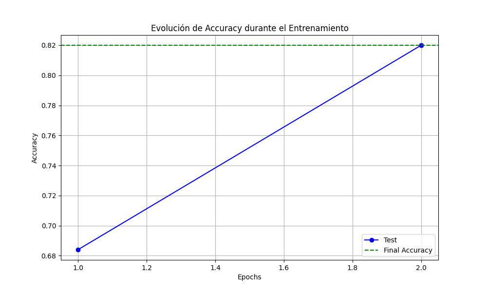
   - La precisión mejora con las épocas, pasando de 0.68 en la primera a 0.82 en la segunda.
   - Indica que el modelo ha convergido correctamente.

2️⃣ **📊 Evolución de Accuracy y F1-Score**
   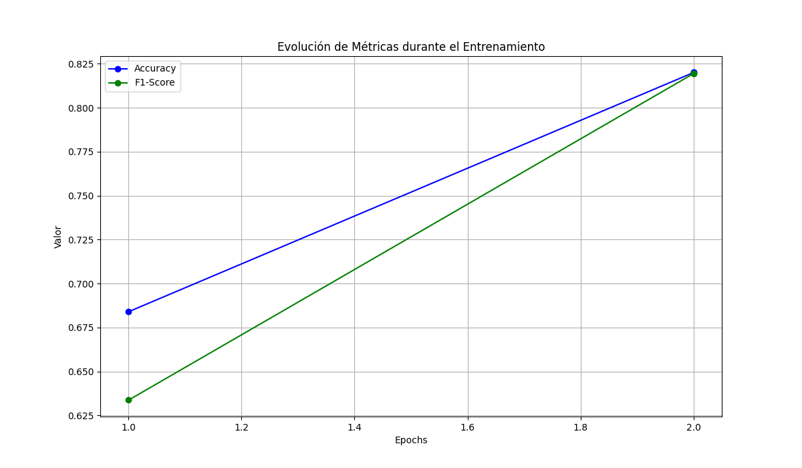
   - Ambas métricas han aumentado progresivamente, lo que indica una mejora consistente del modelo.
   - F1-score muestra balance entre precisión y recall.

3️⃣ **🎯 Matriz de Confusión**
   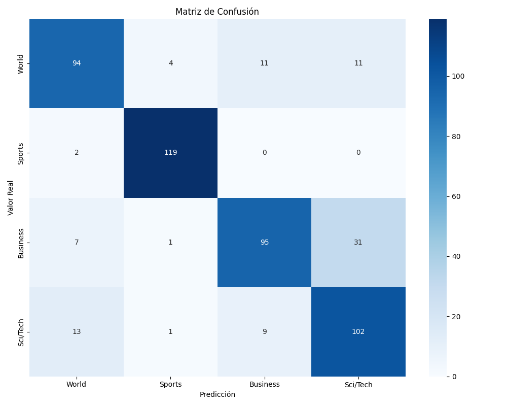
   - Predicciones correctas e incorrectas del modelo.
   - Se observan errores en clases similares, como "Business" y "Sci/Tech".

4️⃣ **📊 Evolución del F1-Score**
   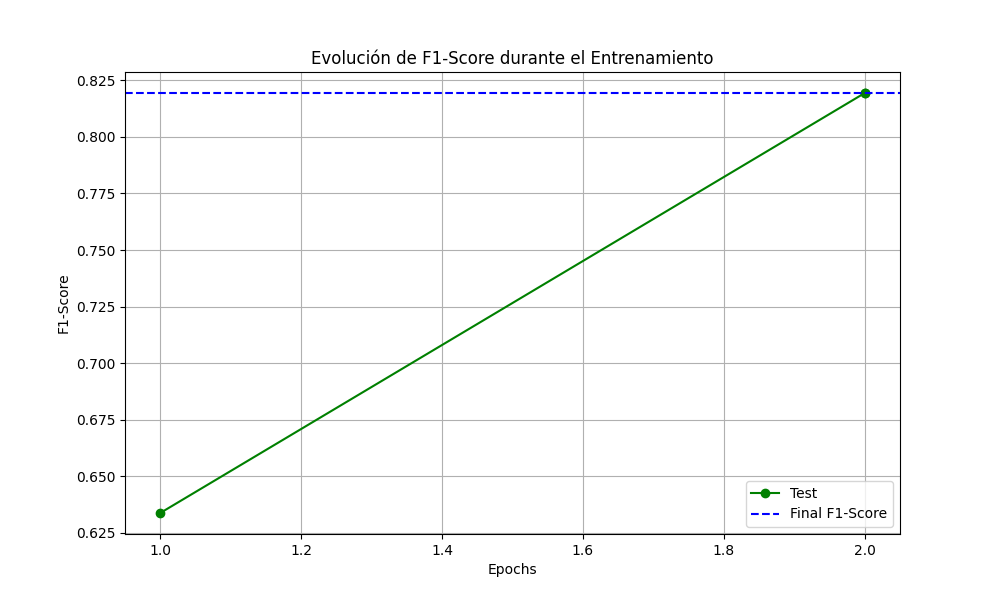
   - Muestra un aumento en F1-score, indicando una mejora en el equilibrio entre precisión y recall.

5️⃣ **🏆 Métricas Finales**
   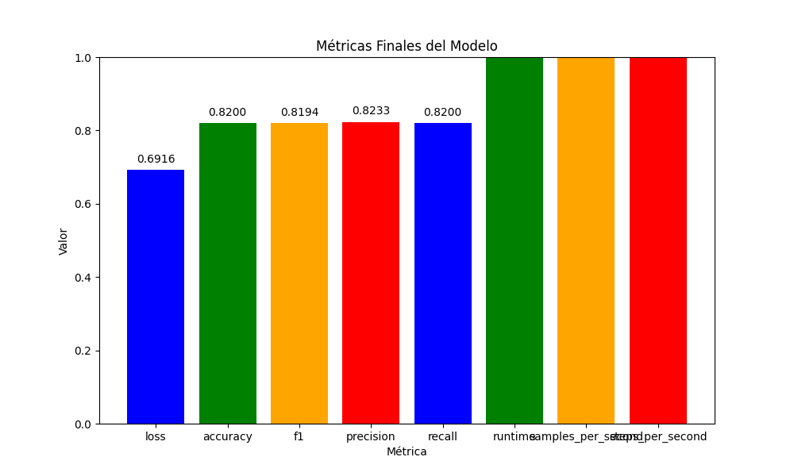
   - **Loss**: 0.6916, indicando un error bajo.
   - **Accuracy**: 0.82, reflejando buen desempeño.
   - **F1-Score**: 0.8194, alineado con la accuracy.
   - **Precisión y Recall**: 0.8233 y 0.82 respectivamente, sin sesgo hacia falsos positivos o negativos.

6️⃣ **📉 Función de Costo**
   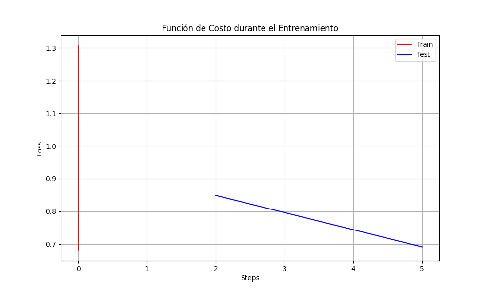
   - La función de pérdida disminuye con las épocas, mostrando aprendizaje estable.
   - No hay indicios de sobreajuste.

---
## MLflow desde local

1️⃣ **Metricas del Modelo 1**
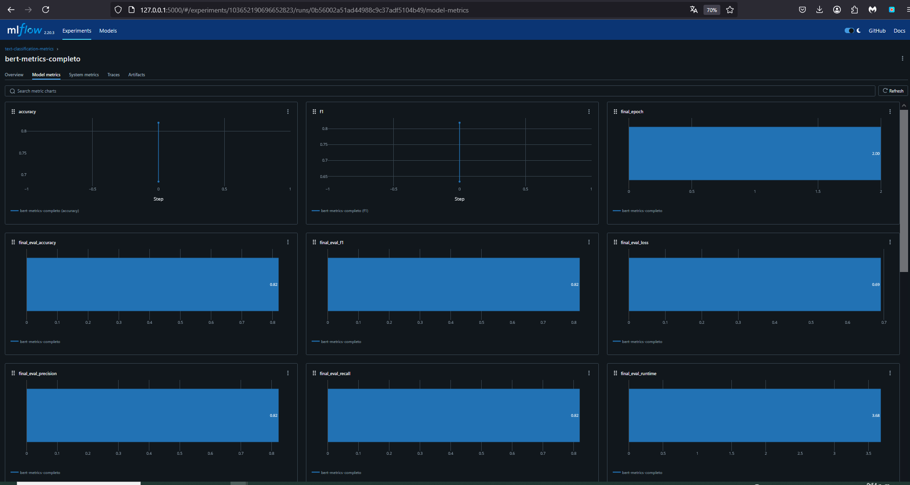

2️⃣ **Metricas del Modelo 2**
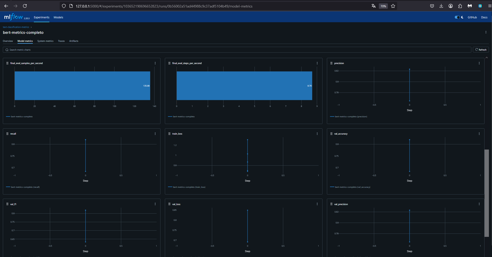

3️⃣ **Metricas del Modelo 3**
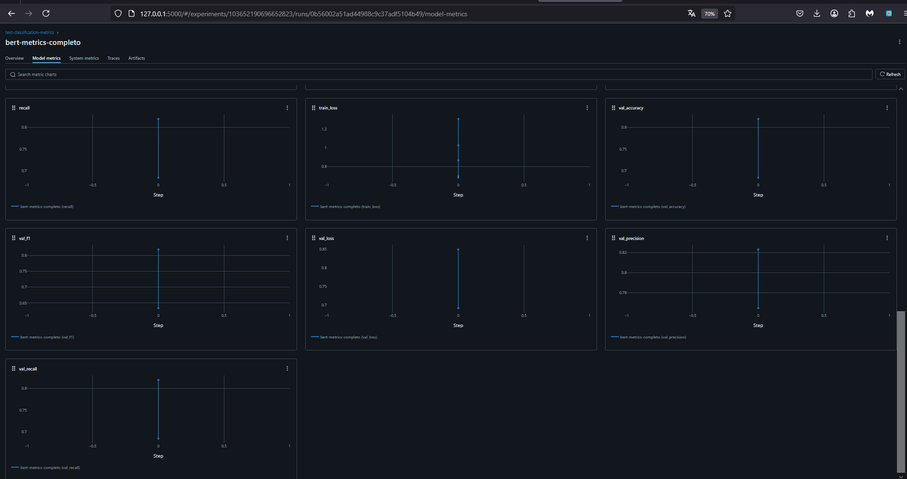

4️⃣ **Metricas del Modelo 4**
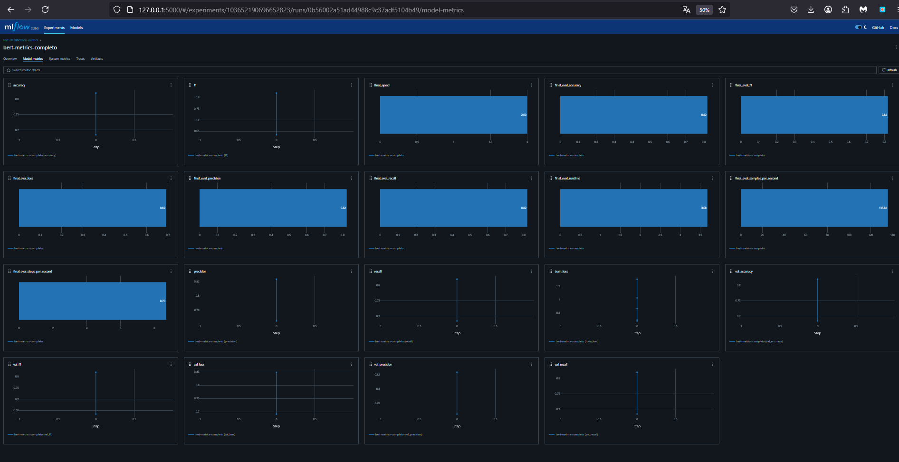

5️⃣ **Overview**
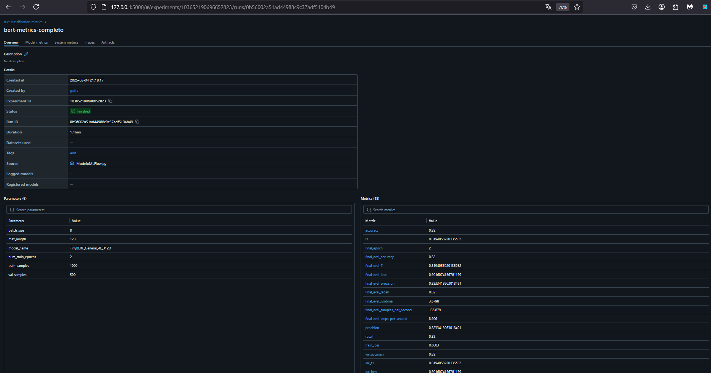

6️⃣ **Artifacts**
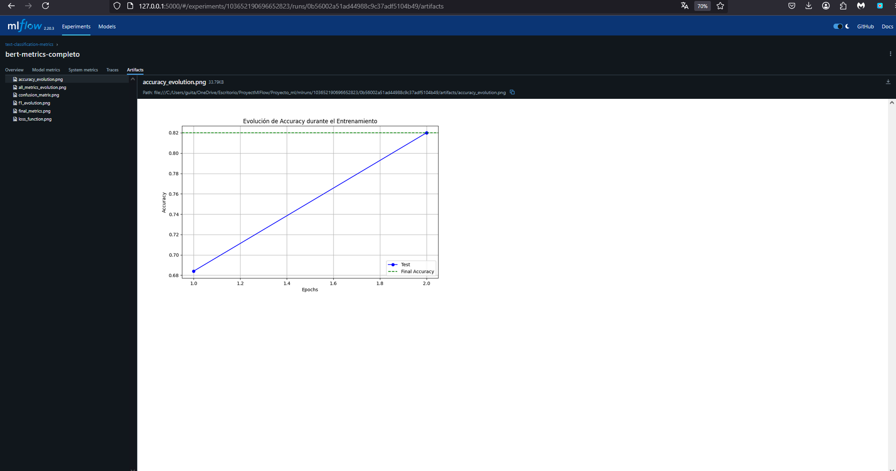

---
## 📦 Requisitos

```bash
torch
transformers
datasets
scikit-learn
matplotlib
numpy
mlflow
seaborn
```

---

## 🛠 Instalación

1️⃣ Clona el repositorio:
   ```bash
   git clone https://github.com/yourusername/Proyecto_MLFlow.git
   cd Proyecto_MLFlow
   ```

2️⃣ Instala las dependencias:
   ```bash
   pip install torch transformers datasets scikit-learn matplotlib numpy mlflow seaborn
   ```

---

## 🏗 Estructura del Proyecto

```
ProjectoMLFlow/
│
├── 📜 ModeloMLFlow.py         # Script principal con el código de entrenamiento
├── 📂 modelo_final/           # Modelo entrenado
├── 📂 results/                # Resultados del entrenamiento
├── 📂 graficas/               # Gráficas generadas
├── 📂 logs/                   # Logs del entrenamiento
└── 📜 README.md               # Este archivo
```

---

## 🔍 Conclusión General

🔹 **Resultados óptimos** en el entrenamiento, a pesar de limitaciones computacionales.
🔹 **Aprendizaje positivo** reflejado en mejoras de **accuracy** y **F1-Score**.
🔹 **Confusión en algunas clases** que puede mejorar con más datos y ajustes en hiperparámetros.
🔹 **Tendencia decreciente en la función de pérdida**, sugiriendo un buen aprendizaje.

---

## ⚠️ Limitaciones

⚠️ Uso de un dataset reducido para optimizar tiempos de entrenamiento.
⚠️ Algunas clases pueden requerir mayor ajuste en hiperparámetros.
⚠️ Para grandes modelos, puede requerirse **más recursos computacionales**.

---


