# Especializacion en IA UAO

## Grupo 3

## Integrantes: 

- Pablo Andrés Muñoz Martínez  -   **Código**: 2244676

- Leidy Yasmin Hoyos Parra - **Código**: 2245224 
                
- Johan David Mendoza Vargas  - **Código**: 2245019
                
- Yineth Tatiana Hernández Narvaez  -  **Código**: 2244789 
                
---

# 📌 Proyecto de Monitoreo en ML - IA con TinyBERT, BERT-Mini y DistilBERT con MLflow

Este proyecto implementa un modelo de clasificación de texto utilizando **TinyBERT**, **BERT-Mini** y **DistilBERT**, con seguimiento completo de métricas y visualizaciones mediante **MLflow**.

---

## 📖 Introducción

Este proyecto utiliza modelos de la familia BERT para clasificar textos del dataset **AG News** en cuatro categorías. Durante el entrenamiento, se monitorea el rendimiento mediante métricas clave como **accuracy, F1-score, precision y recall**, además de generar visualizaciones para facilitar el análisis de resultados.

El objetivo es comparar el rendimiento de estos modelos y determinar cuál ofrece la mejor precisión y generalización.

---

## 🎯 Justificación

La clasificación de texto es esencial en aplicaciones como la organización automática de noticias. Se ha elegido **AG News** por su relevancia y tamaño, mientras que los modelos de la familia **BERT** permiten balancear rendimiento y eficiencia computacional. **MLflow** facilita el monitoreo del entrenamiento y la visualización de métricas para detectar problemas como el sobreajuste.

---

## 🎯 Objetivos

1️⃣ **Entrenar** y comparar **TinyBERT**, **BERT-Mini** y **DistilBERT** en la tarea de clasificación de texto.  

2️⃣ **Monitorear** el entrenamiento mediante gráficas de la función de costo y métricas de desempeño.  

3️⃣ **Evaluar** el rendimiento de cada modelo con métricas específicas.  

4️⃣ **Utilizar MLflow** para registrar y visualizar los resultados del experimento.  

5️⃣ **Presentar un análisis comparativo** de los modelos.  

---

## 📂 Dataset: AG News

El dataset **AG News** contiene noticias categorizadas en cuatro clases:

- 🌍 **Mundo** (Clase 0)
- 🏆 **Deportes** (Clase 1)
- 💰 **Negocios** (Clase 2)
- 🔬 **Ciencia/Tecnología** (Clase 3)

Cada instancia consta de un título y una descripción de la noticia, junto con su etiqueta correspondiente. Se ha reducido el tamaño a **1000 muestras para entrenamiento** y **500 para test**.

---

## 🤖 Modelos

Se entrenaron y compararon los siguientes modelos:

- **TinyBERT** 🏋️‍♂️: Versión compacta y eficiente de BERT.

- **BERT-Mini** 📏: Un modelo con una estructura reducida de BERT.

- **DistilBERT** 🚀: Modelo liviano que retiene el 97% del rendimiento de BERT con solo el 60% de los parámetros.

---
## MLflow desde local

1️⃣ **Metricas del Modelo 1**

2️⃣ **Metricas del Modelo 2**

3️⃣ **Metricas del Modelo 3**

4️⃣ **Metricas del Modelo 4**

5️⃣ **Overview**

6️⃣ **Artifacts**

---

## 📊 Análisis de Cada Modelo

### **TinyBERT**
#### **Evolución de Accuracy**
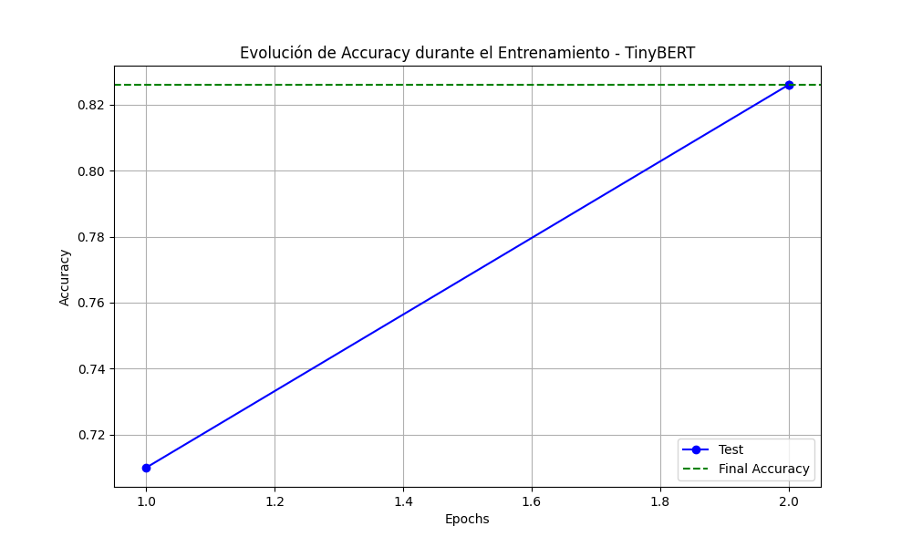
- El modelo **mejoró su accuracy** desde 0.715 hasta 0.825 en dos épocas.
- Su crecimiento es estable, pero se mantiene **por debajo de los otros modelos**.

#### **Matriz de Confusión**

- **Más confusión** en las clases **Business y Sci/Tech**, lo que indica dificultades en la separación de categorías similares.

#### **Evolución de F1-Score**

- Su **F1-score final es 0.8247**, el más bajo de los tres modelos.

#### **Función de Costo**
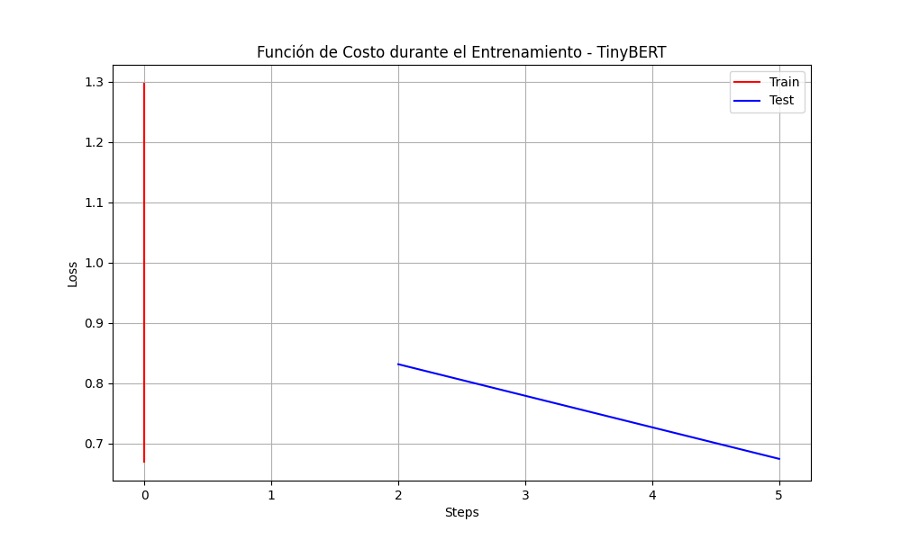
- **Disminución progresiva**, pero su pérdida inicial es mayor, indicando menor eficiencia en aprendizaje.

---

### **BERT-Mini**
#### **Evolución de Accuracy**
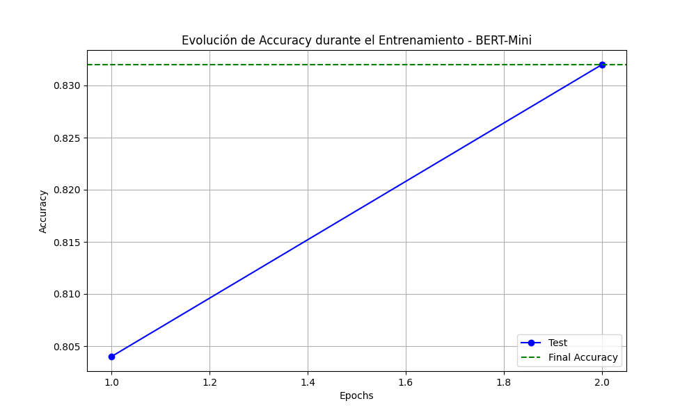
- Accuracy final **0.832**, mejor que TinyBERT pero inferior a DistilBERT.

#### **Matriz de Confusión**
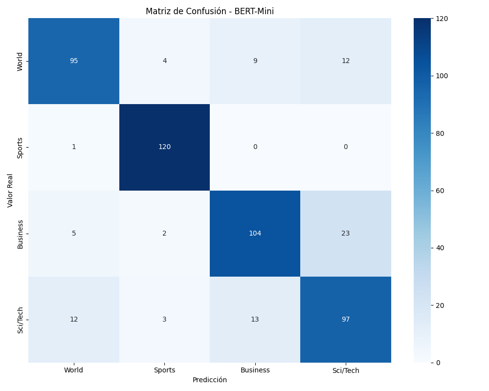
- **Menos confusión** que TinyBERT, pero sigue habiendo errores entre **Business y Sci/Tech**.

#### **Evolución de F1-Score**

- Su **F1-score es 0.8311**, ligeramente mejor que TinyBERT.

#### **Función de Costo**
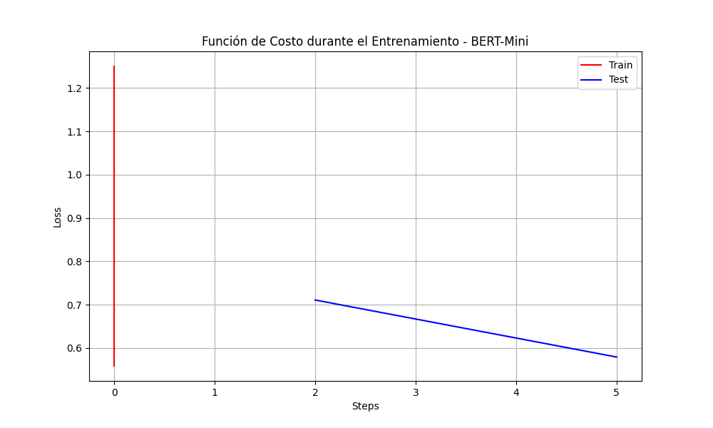
- **Mejor reducción de pérdida** en comparación con TinyBERT.

---

### **DistilBERT**
#### **Evolución de Accuracy**
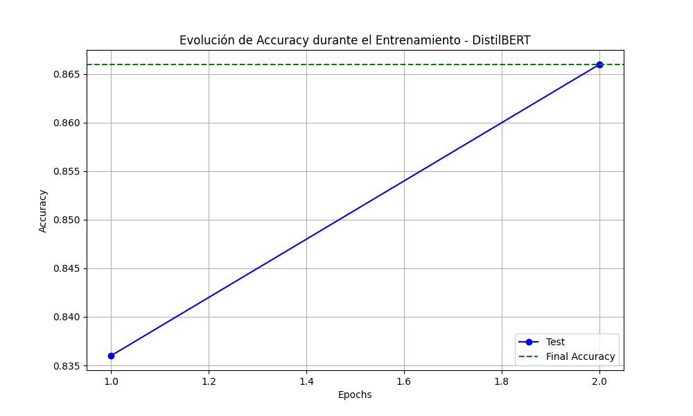
- **Accuracy más alta** con **0.866**, mostrando la mejor estabilidad.

#### **Matriz de Confusión**

- **Menor confusión entre clases**, indicando mejor generalización.

#### **Evolución de F1-Score**
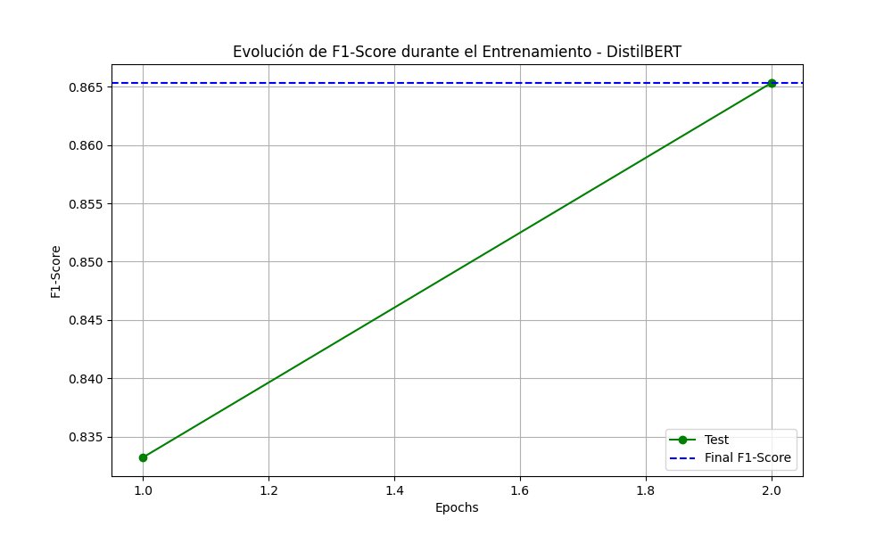
- **Mejor balance entre precisión y recall**, con un **F1-score de 0.8653**.

#### **Función de Costo**
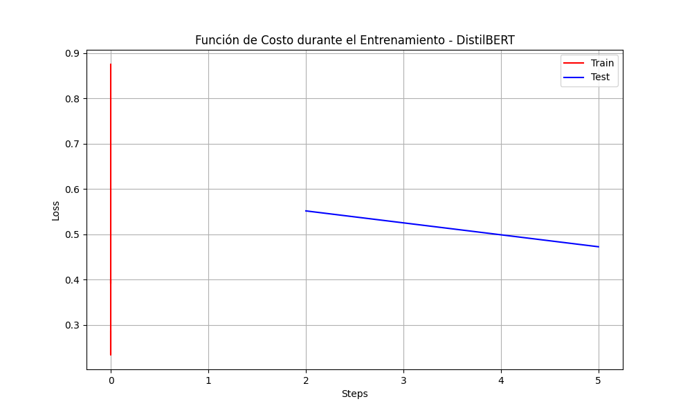
- **Menor pérdida y mejor convergencia** en comparación con los otros modelos.

---

## 📊 Comparación de Modelos

### **Comparación de Accuracy entre Modelos**

- **DistilBERT supera a los demás** con **0.866**.

### **Evolución de Accuracy**
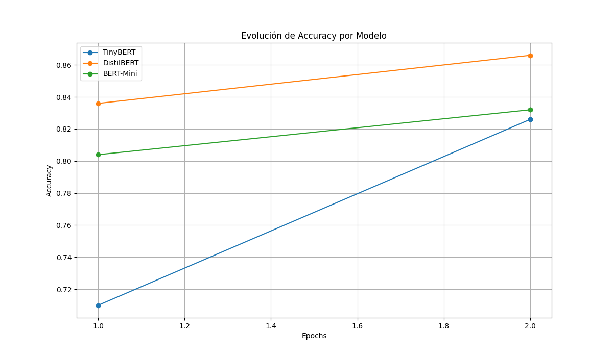
- **DistilBERT tiene la curva más estable**, con mejor precisión desde el inicio.

### **Comparación de Todas las Métricas**
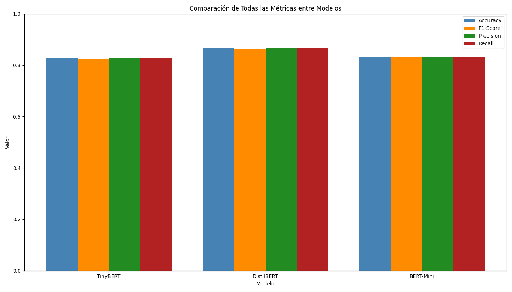
- DistilBERT lidera en todas las métricas, TinyBERT es el más débil.

### **Comparación de F1-Score**
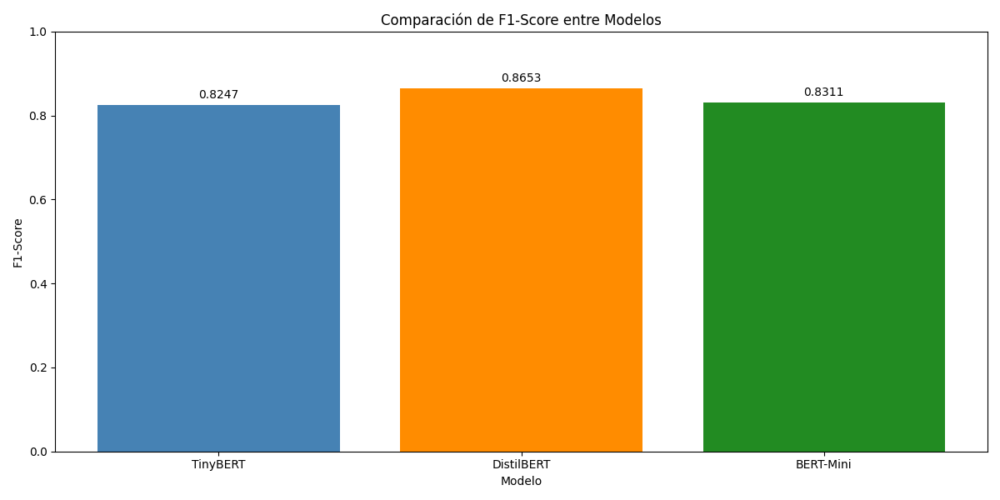
- **DistilBERT con el F1-score más alto**, indicando mejor balance de clasificación.

### **Gráfico Radar – Comparación Completa**
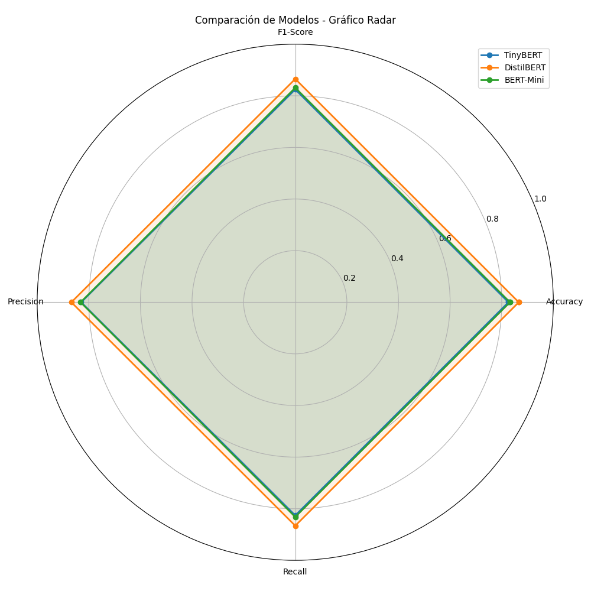
- **DistilBERT domina todas las métricas** y es el modelo más robusto.

---

## 🏆 **Conclusión Final**
1️⃣ **DistilBERT es el mejor modelo**, con **mayor precisión y menor confusión**.  

2️⃣ **BERT-Mini es una alternativa intermedia**, con **buen rendimiento pero inferior a DistilBERT**.  

3️⃣ **TinyBERT es el menos eficiente**, con **más errores de clasificación y menor precisión**.  

---

## ⚠️ Limitaciones

⚠️ Uso de un dataset reducido para optimizar tiempos de entrenamiento.
⚠️ Algunas clases pueden requerir mayor ajuste en hiperparámetros.
⚠️ Para grandes modelos, puede requerirse **más recursos computacionales**.

---

